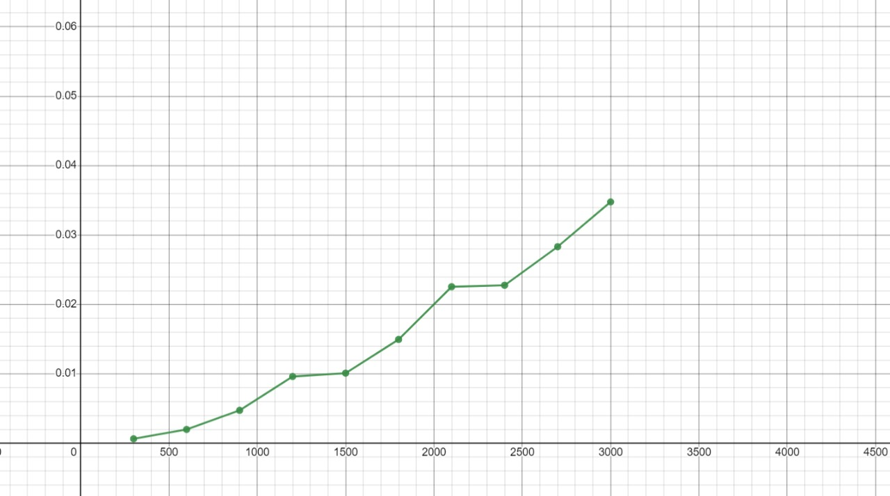
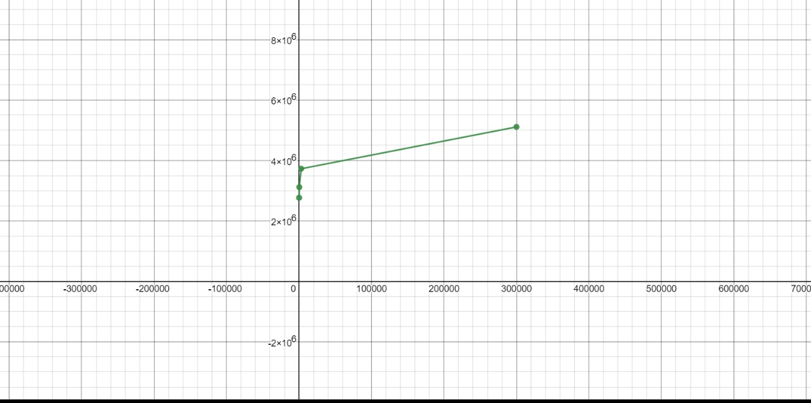

# Matrix vector Multiplication 

In this repository, there are matrix vector multiplication results by using random integers, its time complexity and also its memory usage.
## Run

Before running the algorithm, make sure to do this first:

```c
make clear
```
After that, run this code. This code will create mylib.o automatically and create main.out
```c
make main
```
Lastly, running this code will ask the user to input a number for the matrix size.
```c
./main.out
```
The program will generate random integers with the given matrix size and the results will be like this (result may differ in each try):
```
Input N:3
Matrix=[
5,      5,      2,
1,      2,      4,
2,      2,      1,      ]
Vector=[
4,
5,
1,      ]
Result=[
47,
18,
19,     ]
```

## Time complexity Benchmark
Running these codes will show the amount of time it takes to run an algorithm.

To see the time complexity of matrix multiplication vector, you need to do this:
```c
make time
./time.out
```
Then the program will ask the user to input a number
```
Input N:
```
Thus. it will generate random integers and run from matrix size of N to matrix size of N*10. Furthermore, it will add increment of N after the program finishes calculating previous size. 

Lastly, the program will create a file and write the results of each N called "timelist.dat" which will display the results below: (results may be varied.)
\
\
If N = 30:
```
'(30,0.000004),(60,0.000027),(90,0.000066),(120,0.000133),(150,0.000162),(180,0.000224),(210,0.000356),(240,0.000440),(270,0.000578),(300,0.000627)'
```
If N = 300:
```
'(300,0.000657),(600,0.002002),(900,0.004755),(1200,0.009624),(1500,0.010109),(1800,0.014970),(2100,0.022560),
(2400,0.022773),(2700,0.028321),(3000,0.034780)'
```
30,60,90 means the matrix of N size. 
\
while 0.000004, 0.000027 and 0.000066 means how long the program will finish calculating. 
\


## Space Complexity Benchmark

This will show the total space taken by the algorithm with respect to the input size.

To check the space complexity of matrix multiplication vector, run this code below:
```c
make space
./space.out
```
The program will ask the user to input N and display this.
```
Input N: 10
press Ctrl + C to interrupt the process
```
To make it clear, the N that is inputted by the user is the matrix size. The program will calculate the matrix multiplication vector non-stop until it's interrupted.
\
While the program is running, run a new WSL terminal and type this command.
```
ps aux
```
The results will be like this (Results may differ.):
```
USER       PID %CPU %MEM    VSZ   RSS TTY      STAT START   TIME COMMAND
root         1  0.0  0.0   1744  1084 ?        Sl   16:02   0:00 /init
root         7  0.0  0.0   1752    68 ?        Ss   16:02   0:00 /init
root         8  0.0  0.0   1752    76 ?        S    16:02   0:00 /init
root         9  0.0  0.0   9096  5136 pts/0    Ss   16:02   0:00 -bash
root       464 63.4  0.0   2768  1084 pts/0    R+   20:08   0:12 ./space.out
root       465  0.0  0.0   1752    68 ?        Ss   20:08   0:00 /init
root       466  0.0  0.0   1752    76 ?        R    20:08   0:00 /init
root       467  2.0  0.0   9096  5244 pts/1    Ss   20:08   0:00 -bash
root       482  0.0  0.0  10456  3260 pts/1    R+   20:08   0:00 ps aux
```
After that, you need to find the space.out's PID. As you can see, the PID for ./space.out is 464

Then, you can use the pmap command to find the memory usage.

```
pmap <pid>
``` 
This is the results (results may differ.):
\
If N = 10:
```
464:   ./space.out
000056399fef6000      4K r---- space.out
000056399fef7000      4K r-x-- space.out
000056399fef8000      4K r---- space.out
000056399fef9000      4K r---- space.out
000056399fefa000      4K rw--- space.out
00005639a087a000    132K rw---   [ anon ]
00007fd2d4ec1000     16K r---- libc.so.6
00007fd2d4ec5000      8K rw--- libc.so.6
00007fd2d4ec7000     52K rw---   [ anon ]
00007fd2d4eda000      8K rw---   [ anon ]
00007fd2d4edc000      8K r---- ld-linux-x86-64.so.2
00007fd2d4ede000    168K r-x-- ld-linux-x86-64.so.2
00007fd2d4f08000     44K r---- ld-linux-x86-64.so.2
00007fd2d4f14000      8K r---- ld-linux-x86-64.so.2
00007fd2d4f16000      8K rw--- ld-linux-x86-64.so.2
00007fff97299000    132K rw---   [ stack ]
00007fff97346000     16K r----   [ anon ]
00007fff9734a000      4K r-x--   [ anon ]
 total             2768K
```
If N = 300000: (since N = 300 has only slight difference in memory usage with N = 30)
```
524:   ./space.out
000055b4d77c7000      4K r---- space.out
000055b4d77c8000      4K r-x-- space.out
000055b4d77c9000      4K r---- space.out
00007fd625e57000     16K r---- libc.so.6
00007fd625e5b000      8K rw--- libc.so.6
00007fd625e5d000     52K rw---   [ anon ]
00007fd625e70000      8K rw---   [ anon ]
00007fd625e72000      8K r---- ld-linux-x86-64.so.2
00007fd625e74000    168K r-x-- ld-linux-x86-64.so.2
00007fd625e9e000     44K r---- ld-linux-x86-64.so.2
00007fd625eaa000      8K r---- ld-linux-x86-64.so.2
00007fd625eac000      8K rw--- ld-linux-x86-64.so.2
00007ffdf350b000    132K rw---   [ stack ]
00007ffdf35b8000     16K r----   [ anon ]
00007ffdf35bc000      4K r-x--   [ anon ]
 total             5112K
```
Total indicates the memory usage of the program.

## Graphs
Here's the graph for time complexity: (N = 300)

The X-Axis indicates the N (matrix size) while the Y-Axis inidicates the time taken.

Here's the plot for space complexity: (N = 30,300,3000,300000)

The X-Axis indicates the matrix size or N while the Y-axis indicates the memory usage of the program.
